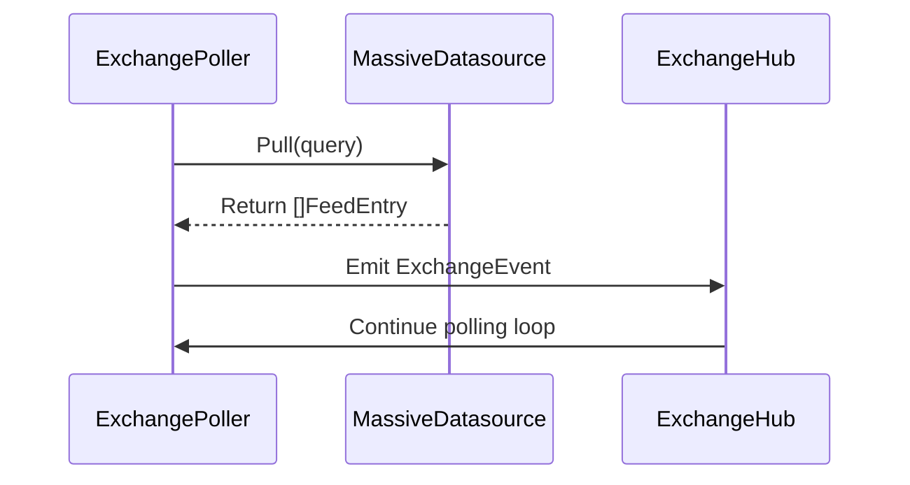

# market-data-feeds.md

## Market Data Feed Architecture

The MogTrade Engine processes market data through a feed abstraction that decouples data sources from the matching engine.

### Feed Interface

Defined in `core/feed/feed.go`, the `Datasource` interface provides:

```go
type Datasource interface {
    Pull(query DatasourceQueryRequest) ([]FeedEntry, error)
    Name() string
}
```

Key characteristics:
- Decouples data source implementation from consumer
- Supports different query types (symbol, interval, date range)
- Returns typed `FeedEntry` objects for consistent processing

### Data Types

- `FeedEntry`: Represents a single market data point with fields like price, volume, timestamp
- `DatasourceQueryRequest`: Encapsulates query parameters for data retrieval

### Implementation Components

1. **MassiveDatasource** (`core/feed/massive.go`):
   - New implementation for aggregate bar data
   - Fetches recent aggregate bars from Massive API (Polygon.io)
   - Converts API response to internal `TradeData` structure
   - Configurable request timeout
   - Implements `feed.Datasource` interface

2. **AlphaVantageDatasource** (`core/feed/alphavantage.go`):
   - Existing implementation for tick-level data
   - Provides historical and real-time price data
   - Handles API rate limits and errors

3. **ExchangePoller** (`services/market/exchange-poller.go`):
   - Polls configured data sources at regular intervals (50 seconds by default)
   - Handles polling logic and error recovery
   - Emits market events via ExchangeHub

### Event Flow



### Key Design Points

- **Separation of Concerns**: Data retrieval vs. data processing vs. event emission
- **Extensibility**: New data sources can be added by implementing `Datasource` interface
- **Error Handling**: Robust error handling with retries and circuit breakers
- **Performance**: Efficient data parsing and minimal memory allocation
- **Configurability**: Request timeout, polling interval, and symbol filtering configurable

### Integration Points

- **IoC Container**: Registered in `app/cmd/ioc.go` as `feed.NewMassiveDatasource()` and `feed.NewAlphaVantageDatasource()`
- **Matching Engine**: Consumes market data indirectly through order book updates (not directly from feed)
- **API Layer**: Market data can be accessed via `/market/feed` endpoint for real-time streaming

### Future Extensions

- Add WebSocket support for real-time streaming
- Add additional data sources (e.g., crypto exchanges, futures)
- Implement rate limiting for data source calls
- Add data validation and sanitization